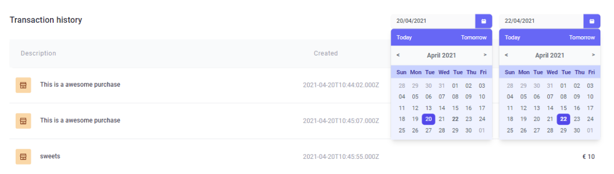
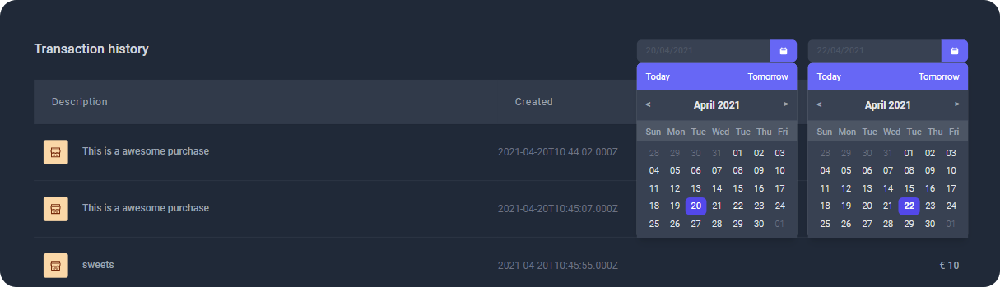

## Finanzer 💰

An intuitive, mobile-friendly interface to track all finances in one place while on the go 🏃‍♂️
Project's dashboard displays summary of user's net balance, current income vs expenses, list of recent transactions and expenses by category chart and graph

### Project details 📁

- Problem statement: Client is unaware of an accurate net balance at any point during the month due to several debit orders scheduled on various dates

* Finanzer solves this problem by having the net balance reflect the coming month's debit orders ahead of time, giving the client clarity on the current state of his finances

### Client requirements 📝

- Responsive design that is mobile focused
- Responsive tables

* First milestone - functioning product ready for user testing

### Features required for milestone 1 🌱

- Secure sign in
- Navigation (animated & responsive navbar)
- Display recent transactions
- Display full transaction history

* Search transaction history by date range

- Create new transactions
- Display net balance
- Display expense chart & graph

### End points ☑️

- Fetch transactions from API
- Create new transactions
- Update transactions
- Delete transactions

### Tech stack 📚

- Built using React & Tailwind CSS

### Progress screenshots

